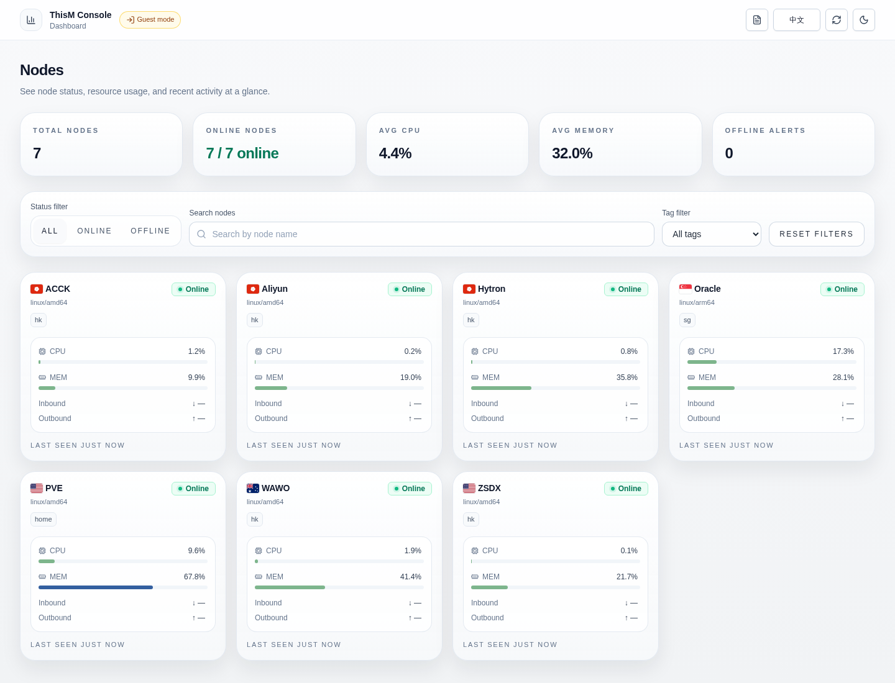
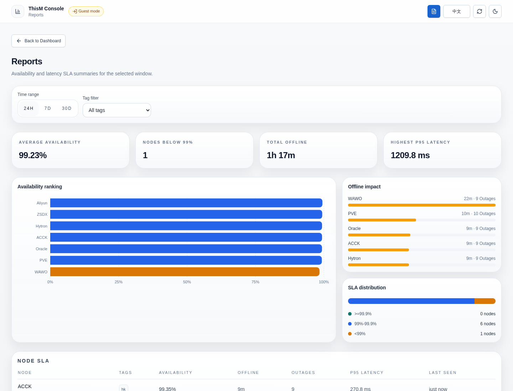
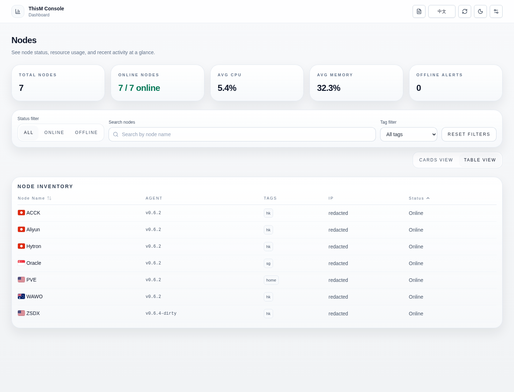
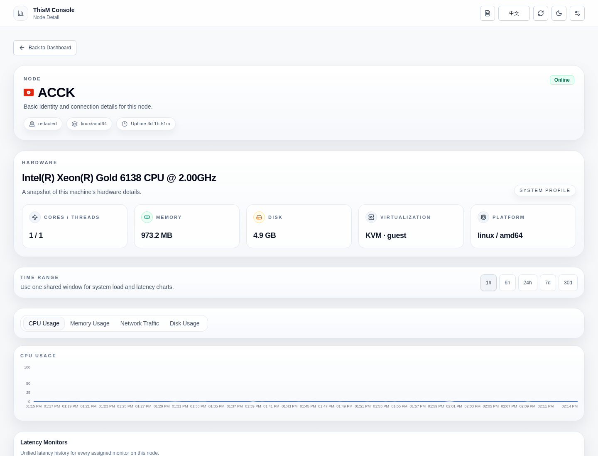
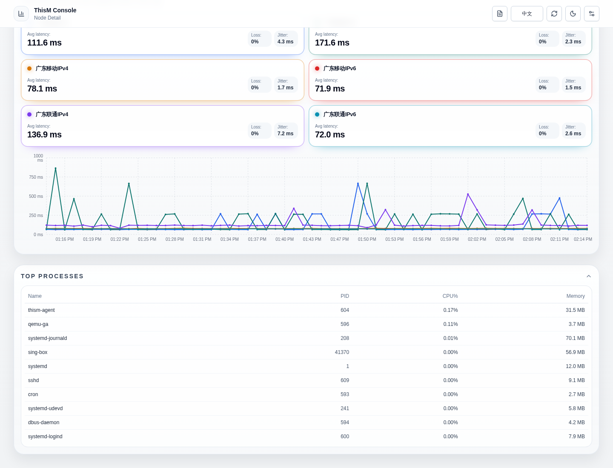
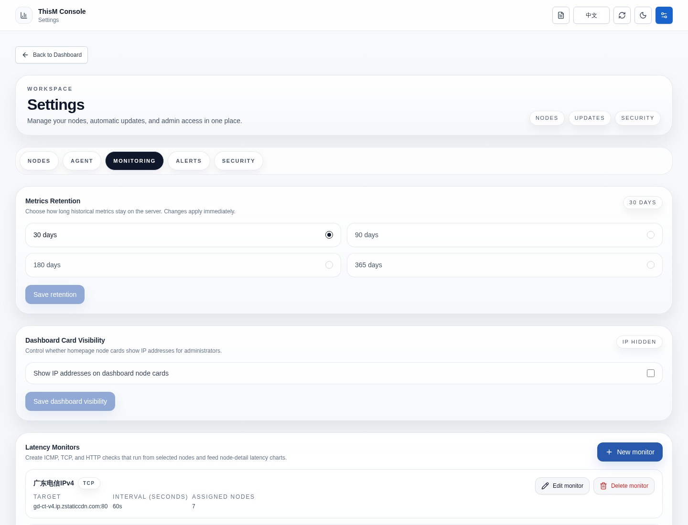
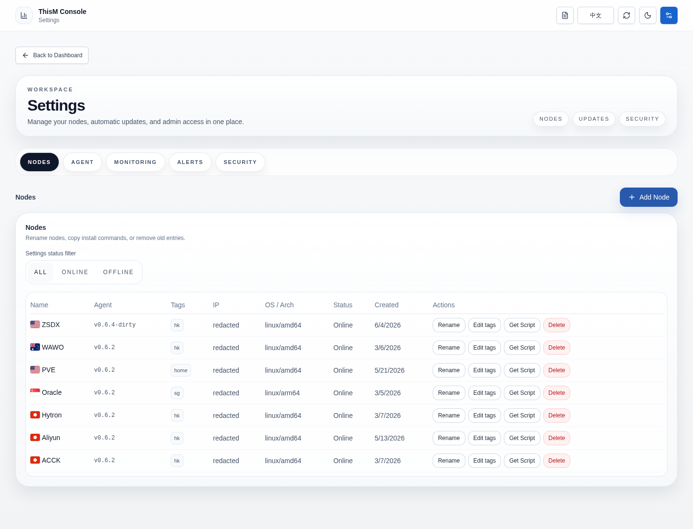

# ThisM

English | [简体中文](README.zh-CN.md)

Lightweight self-hosted server monitoring. One binary, zero external dependencies.

## Preview

<p>
  
</p>

<p>
  
  
</p>

<p>
  
  
</p>

<p>
  
  
</p>

## Highlights

- Single Go server binary with embedded React frontend
- Lightweight Linux agents for monitored nodes
- SQLite storage with no external database requirement
- Server-hosted agent install script and release manifest
- Ed25519-signed agent self-updates (fail-closed when the public key is missing)
- Node tags, tag filtering, and SLA-style availability reports
- Built-in ICMP, TCP, and HTTP latency monitoring from selected nodes
- Node detail diagnostics for load, CPU steal/I/O wait, pressure, swap/OOM, and embedded NVMe/ATA SMART disk health without extra node packages
- Configurable metrics retention, defaulting to 30 days with longer reporting options
- Supports importing custom theme packages from a GitHub release archive or a local zip file
- Prebuilt GHCR image plus Docker Compose deployment path
- Offline GeoIP country codes (IP2Location / MaxMind) managed from Settings or fetched separately, not vendored in git

## Quick Start

### One-command Docker Compose install

```bash
bash <(curl -fsSL https://raw.githubusercontent.com/jsllxx77/thism/main/deploy/install-compose.sh)
```

The installer will:

1. Create a deployment directory
2. Download `compose.yaml` and `.env.example`
3. Generate a random admin password and API token as Docker secret files on first run
4. Prepare the writable GeoIP data directory for the container's runtime UID/GID
5. Start `thism-server` from `ghcr.io/jsllxx77/thism:latest`

Prerequisites:

- Docker with `docker compose` v2 available on the host

When it finishes, open `http://<server-ip-or-domain>:8080` from your browser and log in with the generated credentials. If you are running the installer on the same machine where you will open the browser, `http://localhost:8080` also works.

The generated credentials are stored under `~/thism-deploy/secrets/`. `~/thism-deploy/.env` stores only runtime settings and secret-file paths. Treat the `secrets/` directory as sensitive and back it up if you want to preserve the generated API token and web UI administrator password.

Read the web login credentials with `cat ~/thism-deploy/secrets/thism_admin_user` and `cat ~/thism-deploy/secrets/thism_admin_pass`.

To uninstall the server from the host:

```bash
bash <(curl -fsSL https://raw.githubusercontent.com/jsllxx77/thism/main/deploy/uninstall-server.sh)
```

The uninstall script stops the server and removes the local service/deployment files. It preserves Docker volume data and `/var/lib/thism` by default. To remove stored server data as well, run it with `THISM_REMOVE_DATA=1`. Agents installed on monitored hosts are not removed automatically; run the agent uninstall script on each host if needed.

### Manual Docker Compose deployment

```bash
mkdir -p ~/thism-deploy
cd ~/thism-deploy
curl -fsSL https://raw.githubusercontent.com/jsllxx77/thism/main/deploy/docker-compose.yml -o compose.yaml
curl -fsSL https://raw.githubusercontent.com/jsllxx77/thism/main/deploy/.env.example -o .env

mkdir -p secrets
chmod 700 secrets
printf '%s\n' "$(openssl rand -hex 32)" > secrets/thism_token
printf '%s\n' "admin" > secrets/thism_admin_user
printf '%s\n' "$(openssl rand -hex 32)" > secrets/thism_admin_pass
chmod 444 secrets/thism_*

IMAGE=ghcr.io/jsllxx77/thism:latest
GEO_UID="$(docker run --rm --entrypoint id "$IMAGE" -u)"
GEO_GID="$(docker run --rm --entrypoint id "$IMAGE" -g)"
sudo install -d -m 0755 -o "$GEO_UID" -g "$GEO_GID" /var/lib/thism/geo

# edit .env if you need a different image, host port, secret path, or GeoIP directory
docker compose up -d
```

The default compose deployment stores application data in a named Docker volume and publishes the web UI on port `8080`.

The `.env` file contains runtime settings and secret-file paths. The API token and web login credentials live in `secrets/thism_token`, `secrets/thism_admin_user`, and `secrets/thism_admin_pass`.

Use `cat secrets/thism_admin_user` and `cat secrets/thism_admin_pass` to read the web login credentials.

### Optional offline GeoIP country enrichment

The server starts normally without a GeoIP database; only country-code enrichment stays disabled. To enable it, open **Settings → Monitoring → IP Geolocation Source**, select a provider, enter its credential, save the settings, and click **Update database**.

You can also prefetch both databases from a source checkout:

```bash
git clone --depth 1 https://github.com/jsllxx77/thism.git
cd thism
export IP2LOCATION_TOKEN='...'
export MAXMIND_LICENSE_KEY='...'   # https://www.maxmind.com/en/geolite2/signup
sudo -E ./deploy/fetch-geoip-dbs.sh
# or: make fetch-geoip
```

See `docs/geoip.md`. Use `THISM_GEOIP_DIR` to choose the writable managed database directory. The legacy path overrides below remain available for compatibility, but using either one disables Settings-managed provider selection and database updates:

- `THISM_GEOIP_DB` (primary)
- `THISM_GEOIP_DB_FALLBACK` (secondary)

## Add and Install an Agent

Use the web console for the normal enrollment flow:

1. Open the web UI and sign in as an administrator.
2. Go to `Settings`.
3. In the `Node Management` section, click `Add Node`.
4. Enter the node name and click `Get install command`.
5. Copy the `Install Command` shown by the panel.
6. Run that command as `root` on the target Linux machine.

The generated command installs `thism-agent` into `/usr/local/bin`, writes a `systemd` unit, and starts the service. The installer supports `linux/amd64` and `linux/arm64`.

If the node already exists and you need the command again, open `Settings` -> `Node Management` and click `Get Script` on that node row.

## Node Tags and Reports

Use tags to organize nodes by environment, region, workload, or any other operator-owned grouping.

To edit tags:

1. Open `Settings`.
2. In the `Node Management` section, click `Edit tags` on a node row.
3. Enter comma-separated tags such as `prod, hk, database`.
4. Save the node.

Tags are normalized to lowercase so filters treat `Prod`, `prod`, and `PROD` as the same tag.

The `Reports` page summarizes availability and latency for the selected time window. It includes:

- `24h`, `7d`, and `30d` report ranges
- Tag filtering
- Average availability, nodes below 99%, total offline time, and highest p95 latency
- Availability ranking, offline impact, and SLA distribution charts
- Node-level SLA rows with samples, outages, p95 latency, and last seen status

Availability reports are computed from retained metrics and latency samples. If historical data has already been pruned, older report windows may contain less evidence than the selected range implies.

To uninstall an agent from a monitored Linux host:

```bash
bash <(curl -fsSL https://raw.githubusercontent.com/jsllxx77/thism/main/deploy/uninstall-agent.sh)
```

This removes the local `systemd` service, environment file, agent binary, and version file. It does not delete the node record from the ThisM server. If you no longer want the node listed in the panel, open `Settings` -> `Node Management` and delete it there as well.

## Latency Monitoring

ThisM can run active latency checks from your agents and plot the results on the node detail page.

Current monitor types:

- `ICMP`
- `TCP`
- `HTTP`

To configure a monitor:

1. Open `Settings`.
2. Switch to the `Monitoring` section.
3. Open `Latency Monitors`.
4. Create a monitor, choose the target, interval, and nodes that should run it.
5. Open a node detail page to view the latency chart for the monitors assigned to that node.

## Metrics Retention

Metrics retention controls how long historical metrics and latency samples stay on the server. The default is `30 days`; available options are `30`, `90`, `180`, and `365` days.

To change retention:

1. Open `Settings`.
2. Switch to the `Monitoring` section.
3. Open `Metrics Retention`.
4. Choose the retention period and save.

Changes apply immediately and prune metric rows older than the selected period. Reports and long-range node detail charts depend on this retained history.

## Themes

The ThisM appearance system keeps `Classic` as the only built-in theme and stable recovery baseline. Custom themes use the bundled React frontend and replace its semantic shadcn/ui tokens and supported appearance values.

The `Settings` -> `Appearance` page shows the current theme and theme list. A theme can only be changed by importing a GitHub repository's latest release archive or uploading a local theme zip package.

### Build a Theme Package

A theme package is a `.zip` archive with `thism-theme.json` at the archive root. The manifest must use `type: "thism-theme"` and `version: 1`; its normalized ID cannot be `classic`. Archives are limited to 32 MiB compressed, 96 MiB extracted, and 2048 files.

The manifest contains light and dark semantic tokens. The required core tokens are `background`, `foreground`, `card`, `card-foreground`, `primary`, `primary-foreground`, `border`, `input`, and `ring`. Optional tokens include `secondary`, `muted`, `accent`, `destructive`, `popover`, `chart-1` through `chart-5`, and `sidebar-*`.

The optional `appearance` object supports radius and padding lengths, safe font-family strings, shadows, density (`compact`, `comfortable`, or `spacious`), surface (`solid`, `glass`, or `command`), background (`solid`, `grid`, or `mesh`), and navigation (`solid`, `floating`, or `transparent`).

Minimal archive layout:

```text
thism-theme.json
```

Package and publish it as a GitHub release asset:

```bash
mkdir thism-theme
cd thism-theme
$EDITOR thism-theme.json
zip -r example.thism-theme.zip thism-theme.json
gh release create v1.0.0 example.thism-theme.zip --title v1.0.0 --notes "Initial thisM theme"
```

The GitHub importer accepts a repository URL, loads its latest release, selects a `.zip` release asset, and validates `thism-theme.json` from the archive. The local upload uses the same archive validation path.

## Releases and Update Integrity

Starting with v0.6.0, ThisM agents verify every self-update binary with an Ed25519 signature in addition to the SHA-256 hash. Agents built without a pinned release public key refuse to apply any update (fail closed).

If you only run the upstream Docker image, no extra setup is needed; the upstream agents ship with the project's pinned public key.

If you publish your own builds (fork, internal mirror, self-hosted distribution), you must:

1. Generate a release keypair offline (`make release-keygen`) and keep the private key off the server.
2. Build agents with the public key baked in (`RELEASE_PUBLIC_KEY="$(cat release.pub.b64)" make build-agent-all`).
3. Sign the produced binaries (`make sign-dist`) so the manifest endpoint can serve the `.sig` sidecar files.

See [Release flow](docs/release.md) for the full workflow, key rotation, and failure modes.

## More Documentation

- [Advanced installation options](docs/advanced-install.md): build from source, run the published Docker image directly, or build the Docker image locally
- [systemd deployment templates](docs/systemd.md): use the bundled unit files for manual host installs
- [Development workflow](docs/development.md): local contributor loop, frontend validation, and test/build commands
- [Release flow](docs/release.md): tag-driven release process and published image tags
- [Security roadmap](docs/security-roadmap.md): outstanding hardening work and history of what shipped in 0.6.x
- [Architecture overview](docs/architecture.md): server, agent, transport, storage, and deployment model
- [Contributing](CONTRIBUTING.md): repository contribution guidelines
