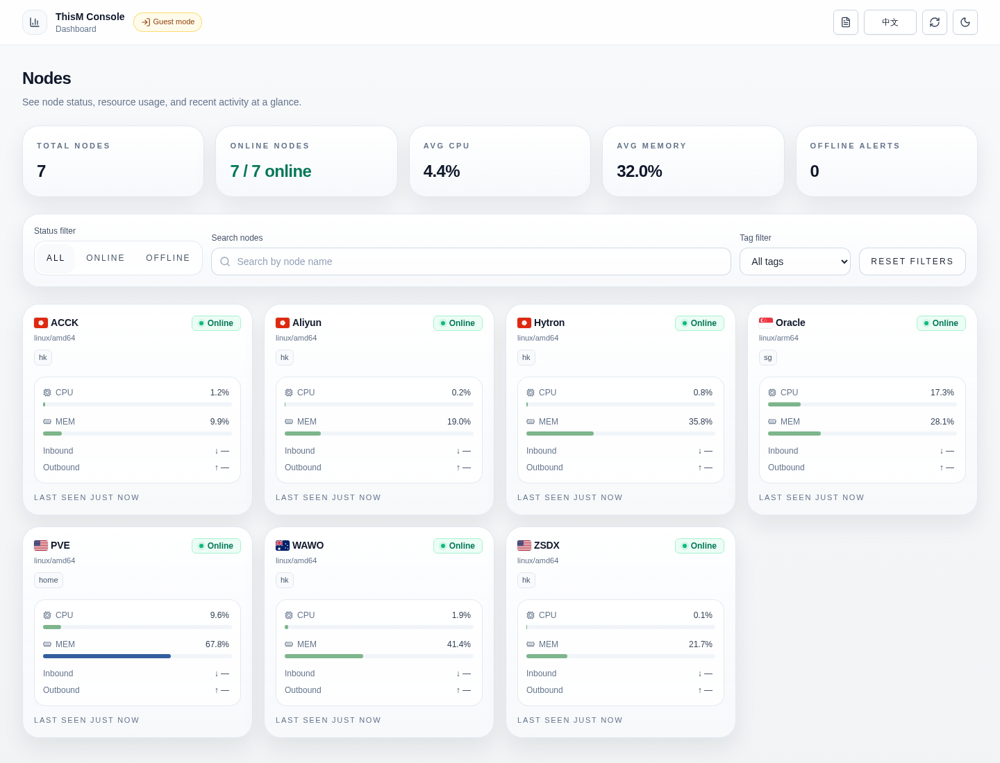
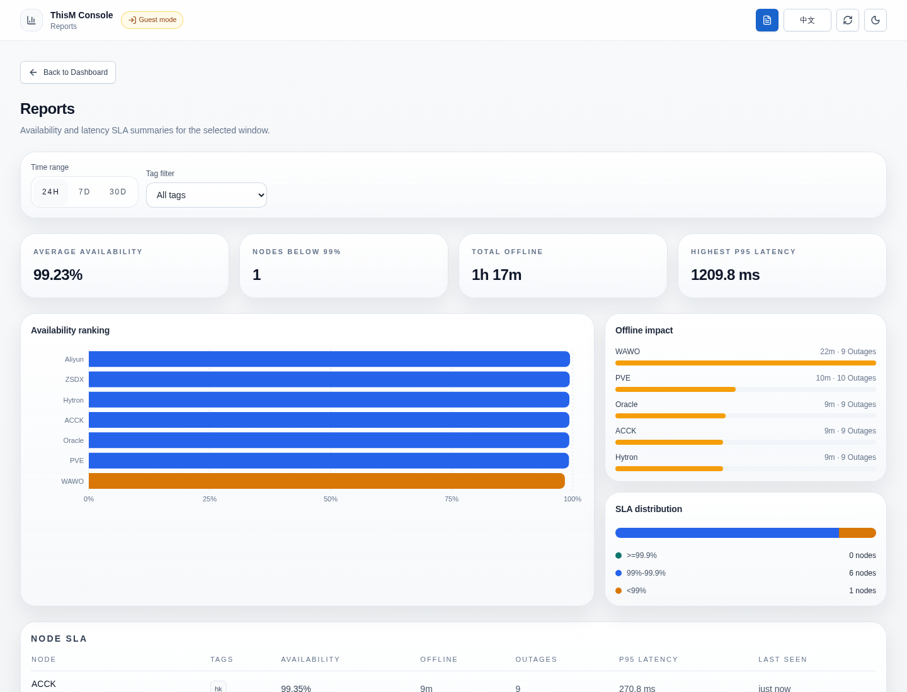
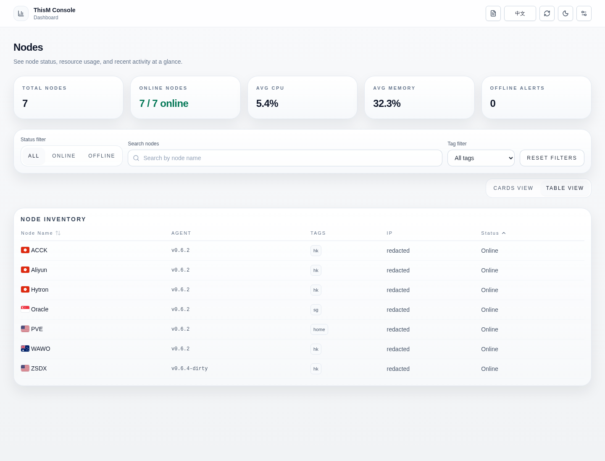
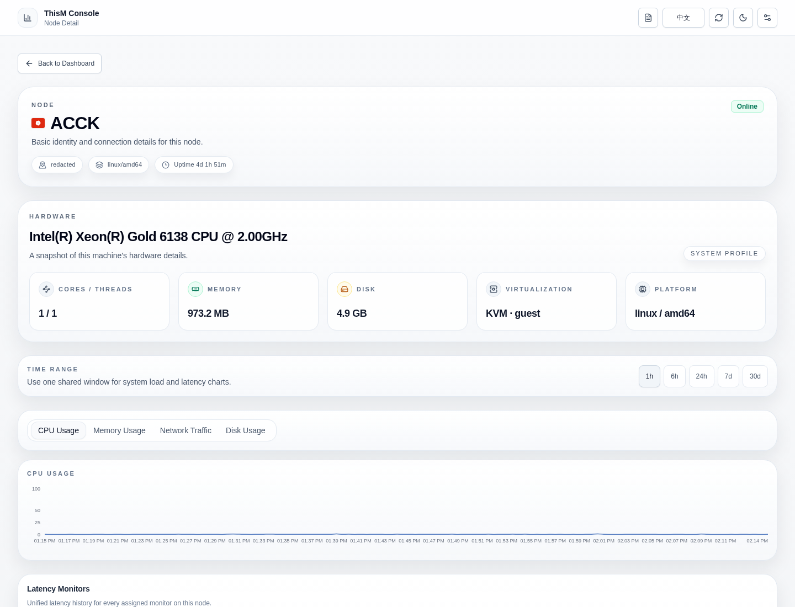
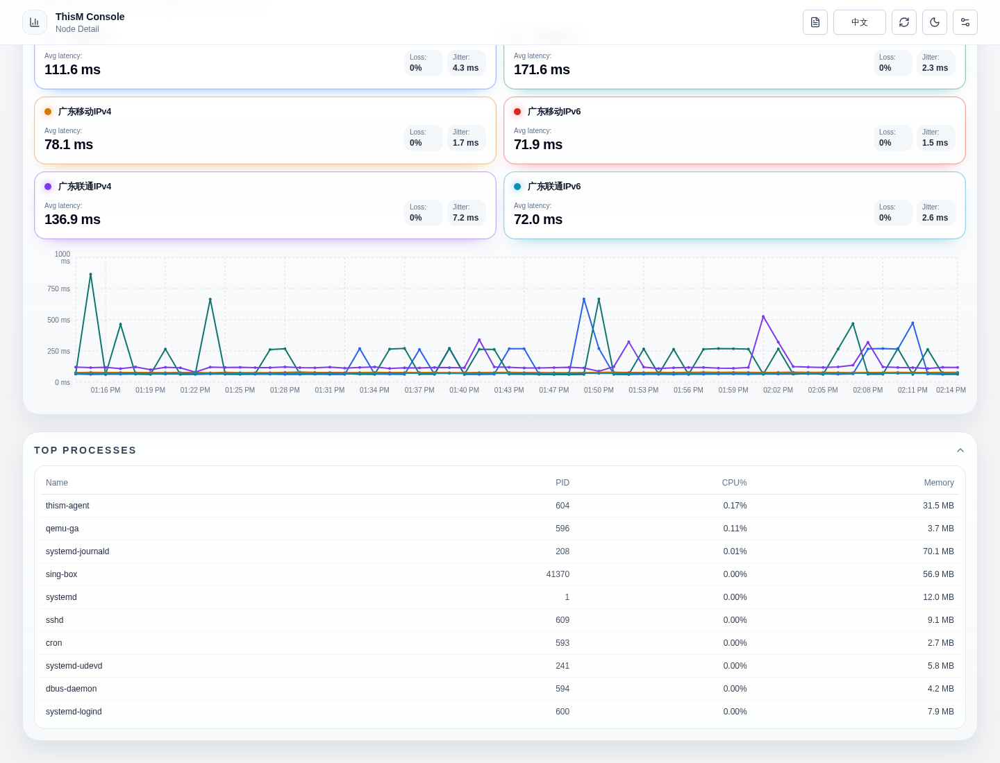
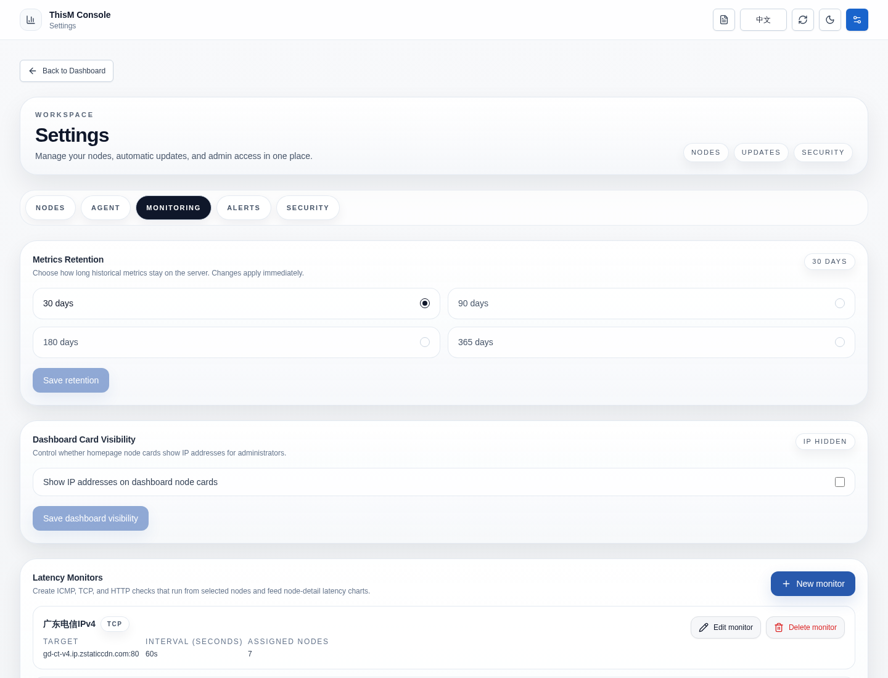
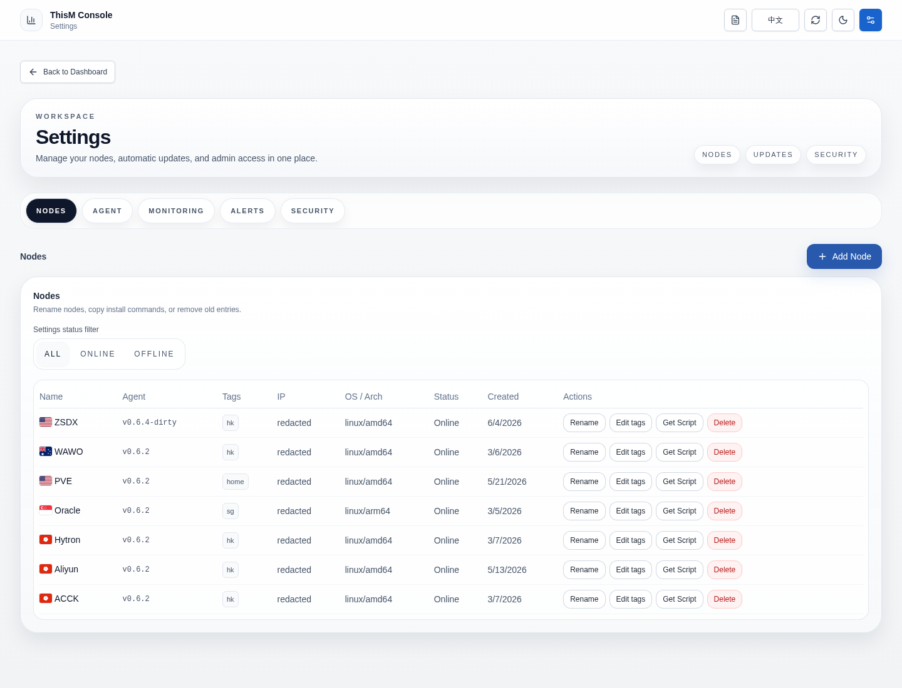

# ThisM

[English](README.md) | 简体中文

轻量级自托管服务器监控。单个二进制，零外部依赖。

## 界面预览

<p>
  
</p>

<p>
  
  
</p>

<p>
  
  
</p>

<p>
  
  
</p>

## 亮点

- 单个 Go 服务端二进制，内嵌 React 前端
- 面向被监控节点的轻量 Linux agent
- 使用 SQLite，无需额外数据库
- 服务端内置 agent 安装脚本与升级清单分发能力
- Agent 自更新带 Ed25519 签名校验（缺公钥时 fail-closed 拒绝更新）
- 节点标签、标签筛选，以及 SLA 风格的可用性报告
- 支持由选定节点执行 ICMP、TCP、HTTP 延迟监测
- 可配置指标保留时长，默认 30 天，并支持更长报告窗口
- 支持从 GitHub 安装运行时 shadcn/ui 主题包和完整前端皮肤包
- 提供预构建 GHCR 镜像与 Docker Compose 部署方式

## 快速开始

### 一键 Docker Compose 安装

```bash
bash <(curl -fsSL https://raw.githubusercontent.com/jsllxx77/thism/main/deploy/install-compose.sh)
```

安装脚本会自动：

1. 创建部署目录
2. 下载 `compose.yaml` 和 `.env.example`
3. 首次运行时生成随机管理员密码和 API Token
4. 从 `ghcr.io/jsllxx77/thism:latest` 启动 `thism-server`

前提条件：

- 目标主机已安装 Docker，并且可用 `docker compose` v2

安装完成后，请在浏览器中打开 `http://<服务器 IP 或域名>:8080`，并使用脚本输出的账号密码登录。如果你是在本机安装并且也在本机访问，`http://localhost:8080` 同样可用。

生成的凭据会保存在 `~/thism-deploy/.env`。这个文件包含 API Token 和 Web 管理员密码，应按敏感文件妥善保管。

如需在当前主机上卸载 server：

```bash
bash <(curl -fsSL https://raw.githubusercontent.com/jsllxx77/thism/main/deploy/uninstall-server.sh)
```

卸载脚本会停止 server，并删除本机服务/部署文件。默认会保留 Docker 数据卷和 `/var/lib/thism`。如果也要删除服务端保存的数据，请使用 `THISM_REMOVE_DATA=1` 执行。其他被监控主机上的 agent 不会自动删除，如需清理，请分别在对应主机执行 agent 卸载脚本。

### 手动 Docker Compose 部署

```bash
mkdir -p ~/thism-deploy
cd ~/thism-deploy
curl -fsSL https://raw.githubusercontent.com/jsllxx77/thism/main/deploy/docker-compose.yml -o compose.yaml
curl -fsSL https://raw.githubusercontent.com/jsllxx77/thism/main/deploy/.env.example -o .env

# 首次启动前请先编辑 .env
docker compose up -d
```

默认 compose 部署会把数据保存在 Docker 命名卷中，并将 Web 界面暴露在 `8080` 端口。

`.env` 文件里保存了 API Token 和 Web 登录凭据。请注意保密，并在需要保留原始凭据时做好备份。

## 添加并安装 Agent

常规接入流程直接通过 Web 面板完成：

1. 打开 Web 界面，并以管理员身份登录。
2. 进入 `设置` 页面。
3. 在 `节点管理` 区域点击 `添加节点`。
4. 输入节点名称后，点击 `获取安装命令`。
5. 复制面板里显示的 `安装命令`。
6. 在目标 Linux 机器上以 `root` 身份执行该命令。

生成的命令会把 `thism-agent` 安装到 `/usr/local/bin`，写入 `systemd` 服务，并启动 agent。安装器支持 `linux/amd64` 和 `linux/arm64`。

如果节点已经存在，之后需要再次获取命令，可以进入 `设置` -> `节点管理`，在对应节点行点击 `获取脚本`。

## 节点标签与报告

可以用标签按环境、地区、业务负载或其他运维维度组织节点。

编辑标签：

1. 进入 `设置` 页面。
2. 在 `节点管理` 区域点击节点行上的 `编辑标签`。
3. 输入英文逗号分隔的标签，例如 `prod, hk, database`。
4. 保存节点。

标签会统一规范化为小写，因此 `Prod`、`prod`、`PROD` 会被视为同一个标签。

`报告` 页面会按选定时间窗口汇总可用性与延迟。当前包括：

- `24小时`、`7天`、`30天` 报告范围
- 标签筛选
- 平均可用性、低于 99% 的节点、总离线时长、最高 P95 延迟
- 可用性排行、离线影响、SLA 分布图表
- 节点级 SLA 明细，包括样本数、中断次数、P95 延迟和最后在线状态

可用性报告基于服务器保留的指标和延迟样本计算。如果历史数据已经被清理，较长报告窗口中的可用证据会少于所选时间范围。

如需在被监控 Linux 主机上卸载 agent：

```bash
bash <(curl -fsSL https://raw.githubusercontent.com/jsllxx77/thism/main/deploy/uninstall-agent.sh)
```

该脚本会删除本机的 `systemd` 服务、环境配置文件、agent 二进制和版本文件。它不会删除 ThisM 服务端里的节点记录。如果不想让该节点继续显示在面板中，还需要进入 `设置` -> `节点管理` 手动删除对应节点。

## 延迟监测

ThisM 支持由 agent 主动执行延迟探测，并在节点详情页展示延迟曲线。

当前支持的监测类型：

- `ICMP`
- `TCP`
- `HTTP`

配置方式：

1. 进入 `设置` 页面。
2. 切换到 `监控` 分组。
3. 打开 `延迟监测` 卡片。
4. 新建监测项，选择目标、探测间隔和执行该监测的节点。
5. 进入对应节点详情页，查看分配到该节点的延迟图表。

## 指标保留时长

指标保留时长决定历史指标和延迟样本在服务器上保留多久。默认值为 `30 天`；可选值为 `30`、`90`、`180`、`365` 天。

修改方式：

1. 进入 `设置` 页面。
2. 切换到 `监控` 分组。
3. 打开 `指标保留时长`。
4. 选择保留周期并保存。

保存后会立即生效，并清理早于所选周期的指标行。报告和节点详情中的长时间范围图表都依赖这些被保留的历史数据。

## 主题与前端皮肤

当前 ThisM 外观系统分为三层：

- 内置主题包括 `经典`、`海岸`、`石墨`。它们共享同一套仪表盘布局和卡片几何结构，同时保留不同的配色、密度和控件处理。
- 运行时主题包会保留内置 React 前端，并替换它的 shadcn/ui 语义 token、卡片/面板圆角、密度、字体、界面表面、导航处理和阴影。
- 前端皮肤包会安装一个完整替代前端，格式是包含 `index.html`、CSS 和 JavaScript 的 zip 压缩包。

在 Web 界面中安装：

1. 进入 `设置`。
2. 打开 `外观`。
3. 使用 `主题系统` 导入主题 JSON 文件或 GitHub 主题仓库。
4. 使用 `前端皮肤` 导入皮肤 zip 文件或 GitHub 皮肤仓库。

运行时主题包保存在浏览器 localStorage 中，适合在不替换应用的前提下调整内置 shadcn/ui 仪表盘观感。前端皮肤保存在服务端，适合需要完整自定义 UI 的场景。

运行时主题示例仓库：

```text
https://github.com/jsllxx77/thism-shadcn-operations-theme
```

把这个 URL 粘贴到 `设置` -> `外观` -> `主题系统` -> `GitHub 主题仓库`，即可安装 Shadcn Operations 主题。ThisM 会优先读取最新 release 中的主题资产；如果没有可用资产，则回退查找仓库内约定位置的主题 JSON 文件。

### 自建主题包

主题包是一个 JSON 文件，必须包含 `type: "thism-theme"` 和 `version: 1`。`id` 规范化后只能包含小写字母、数字和连字符，并且不能使用 `classic`、`ocean`、`graphite`。

GitHub 导入器支持直接填写 raw/blob/release URL，也支持填写仓库 URL。仓库导入会先查找最新 release 资产，再查找仓库内的 `thism-theme.json`、`.thism-theme.json`、`theme.json`、`themes/thism-theme.json`、`themes/theme.json`。Release 资产文件名必须是 `thism-theme.json`、`theme.json` 或 `*.thism-theme.json`。

最小示例：

```json
{
  "type": "thism-theme",
  "version": 1,
  "id": "shadcn-operations",
  "name": "Shadcn Operations",
  "description": "Neutral shadcn/ui operations dashboard theme.",
  "accent": "#18181b",
  "tokens": {
    "light": {
      "background": "240 6% 96%",
      "foreground": "240 10% 3.9%",
      "card": "240 6% 99%",
      "card-foreground": "240 10% 3.9%",
      "primary": "240 5.9% 10%",
      "primary-foreground": "0 0% 98%",
      "border": "240 6% 84%",
      "input": "240 6% 84%",
      "ring": "240 5.9% 10%"
    },
    "dark": {
      "background": "240 10% 3.9%",
      "foreground": "0 0% 98%",
      "card": "240 7% 7%",
      "card-foreground": "0 0% 98%",
      "primary": "0 0% 98%",
      "primary-foreground": "240 5.9% 10%",
      "border": "240 3.7% 15.9%",
      "input": "240 3.7% 15.9%",
      "ring": "240 4.9% 83.9%"
    }
  },
  "appearance": {
    "radius": "0.625rem",
    "cardRadius": "0.75rem",
    "panelRadius": "0.75rem",
    "controlRadius": "0.5rem",
    "density": "compact",
    "surface": "solid",
    "background": "solid",
    "navigation": "solid",
    "cardPadding": "0.875rem",
    "panelPadding": "1rem",
    "fontFamily": "\"Inter\", \"Fira Sans\", \"Segoe UI\", sans-serif",
    "monoFontFamily": "\"JetBrains Mono\", \"Fira Code\", \"SFMono-Regular\", monospace",
    "shadow": "none"
  }
}
```

校验器要求同时提供上面示例中的 light/dark 核心 token。完整 shadcn/ui 兼容主题也可以继续提供 `secondary`、`muted`、`accent`、`destructive`、`popover`、`chart-1` 到 `chart-5`、`sidebar-*` 等可选 token。

`appearance` 支持这些运行时字段：

- `radius`、`cardRadius`、`panelRadius`、`controlRadius`、`cardPadding`、`panelPadding`：CSS 长度，例如 `0.75rem`。
- `fontFamily` 和 `monoFontFamily`：安全的字体族字符串。
- `shadow`：安全的 CSS 阴影字符串。
- `density`：`compact`、`comfortable`、`spacious`。
- `surface`：`solid`、`glass`、`command`。
- `background`：`solid`、`grid`、`mesh`。
- `navigation`：`solid`、`floating`、`transparent`。

发布到 GitHub 仓库：

```bash
mkdir thism-theme
cd thism-theme
$EDITOR thism-theme.json
git init
git add thism-theme.json
git commit -m "Add thisM theme"
gh repo create <owner>/<repo> --public --source . --remote origin --push
gh release create v1.0.0 thism-theme.json --title v1.0.0 --notes "Initial thisM theme"
```

完整仓库示例见 `https://github.com/jsllxx77/thism-shadcn-operations-theme`。它包含：

- `thism-theme.json`，可直接导入 ThisM
- `registry-item.json`，可用于 shadcn registry 兼容分发
- `styles/shadcn-theme.css` 和 `styles/shadcn-v4.css`，可用于 shadcn 项目
- ThisM 可通过仓库 URL 自动发现的 release 资产

### 自建前端皮肤包

前端皮肤包是 `.zip` 压缩包，压缩包根目录必须包含 `thism-frontend-skin.json`。皮肤 ID 只能使用小写字母、数字和连字符，并且不能使用保留 ID `classic`。入口文件必须是 HTML。压缩包限制为压缩后 32 MiB、解压后 96 MiB、最多 2048 个文件。

Manifest 示例：

```json
{
  "type": "thism-frontend-skin",
  "version": 1,
  "id": "ops-console",
  "name": "Ops Console",
  "description": "Custom thisM frontend skin.",
  "entry": "index.html",
  "apiVersion": "thism.v1",
  "assets": ["assets/app.css", "assets/app.js"],
  "preview": "preview.png"
}
```

推荐压缩包结构：

```text
thism-frontend-skin.json
index.html
assets/app.css
assets/app.js
preview.png
```

打包并发布：

```bash
zip -r ops-console.thism-frontend-skin.zip thism-frontend-skin.json index.html assets preview.png
gh release create v1.0.0 ops-console.thism-frontend-skin.zip --title v1.0.0 --notes "Initial thisM frontend skin"
```

GitHub 导入器支持直接填写 raw/release URL，也支持填写仓库 URL。仓库导入会先查找最新 release 资产，再查找仓库内的 `thism-frontend-skin.zip`、`frontend-skin.zip`、`skins/thism-frontend-skin.zip`。Release 资产文件名必须是 `thism-frontend-skin.zip` 或 `*.thism-frontend-skin.zip`。

已安装皮肤会保存到服务端的前端皮肤目录。默认目录是数据库路径旁边的 `frontend-skins`；如果数据库路径为空或为 `:memory:`，则使用 `./frontend-skins`。可通过 `THISM_FRONTEND_SKINS_DIR` 或 `thism-server --frontend-skins-dir` 覆盖。

## 发布与更新完整性

从 v0.6.0 起，ThisM agent 在自更新时除了 SHA-256 校验外，还会强制校验 Ed25519 签名。未在构建时嵌入公钥的 agent 会拒绝任何更新（fail-closed）。

如果你只使用官方 Docker 镜像，无需额外配置；上游 agent 出厂带项目自己的固定公钥。

如果你发布自己的构建（fork、内部镜像、自托管发行版），必须：

1. 离线生成发布密钥对（`make release-keygen`），私钥不要留在服务器上。
2. 编译 agent 时把公钥烧入二进制（`RELEASE_PUBLIC_KEY="$(cat release.pub.b64)" make build-agent-all`）。
3. 对产物执行签名（`make sign-dist`），让 manifest 接口能下发 `.sig` 文件。

完整流程、密钥轮换和失败模式见 [发布流程](docs/release.zh-CN.md)。

## 更多文档

- [高级安装选项](docs/advanced-install.zh-CN.md)：从源码构建、直接运行已发布 Docker 镜像、或在本地构建 Docker 镜像
- [systemd 部署模板](docs/systemd.zh-CN.md)：使用仓库内置 unit 文件进行手动主机部署
- [开发流程](docs/development.zh-CN.md)：本地开发循环、前端验证方式与测试/构建命令
- [发布流程](docs/release.zh-CN.md)：标签驱动发布与镜像标签说明
- [安全路线图](docs/security-roadmap.zh-CN.md)：剩余安全加固项与 0.6.x 已完成内容
- [架构说明](docs/architecture.zh-CN.md)：服务端、agent、通信、存储与部署模型概览
- [贡献指南](CONTRIBUTING.md)：仓库贡献约定
